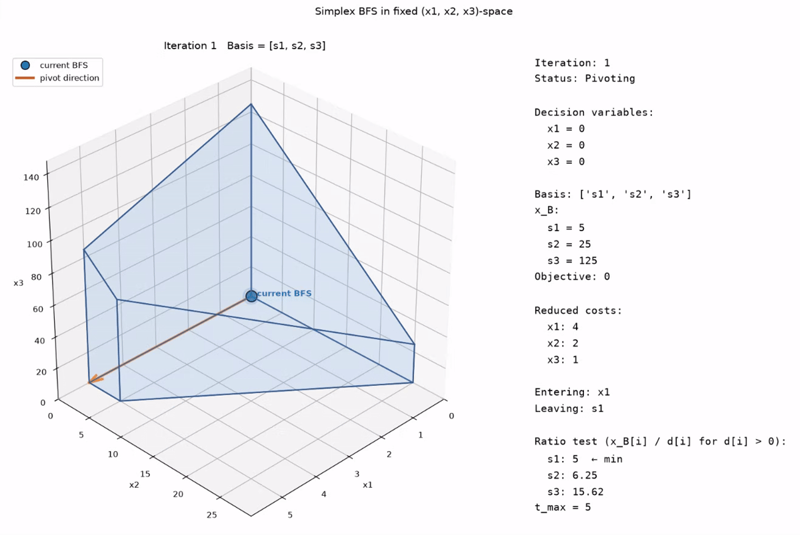

# Optimization

A collection of optimization techniques implemented entirely from scratch
while learning them through coursework.

Every implementation begins with the mathematical formulation of the method
and is translated directly into code using only NumPy.

## Motivation

The goal is to understand optimization algorithms from the ground up rather
than treating them as a collection of rules to memorize.

For each method, the implementation starts from the underlying mathematics:
the optimization problem, its geometric or algebraic structure, and the
steps required to solve it. The resulting algorithm is then implemented
directly in NumPy without relying on optimization libraries.

The emphasis is on understanding the connection between:

**mathematical formulation → algorithm → implementation → behavior**

## Implemented

### Simplex Method

A from-scratch implementation of the simplex method for linear programming,
derived directly from its mathematical formulation and implemented entirely
using NumPy.

The visualization exposes the simplex trajectory through feasible solutions,
including the current basis, pivot direction, reduced costs, and objective
value at each iteration.

The implementation is used to study:

- standard-form linear programs
- basic feasible solutions
- basis selection and exchange
- pivot operations
- the ratio test
- movement between vertices
- the linear-algebraic structure underlying simplex

## Next

This repository will grow as I encounter and learn new optimization
techniques throughout my coursework.

Each implementation will follow the same approach: start from the underlying
mathematics, derive the computational procedure, and implement it from
scratch using only NumPy.
